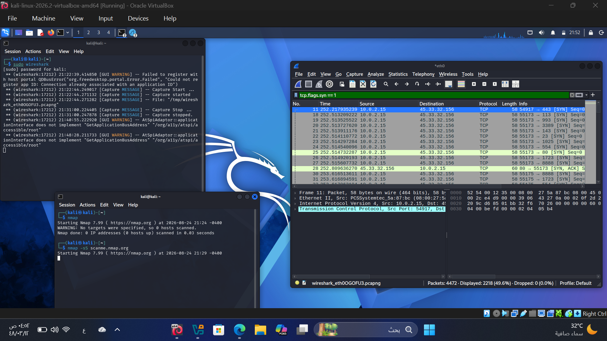
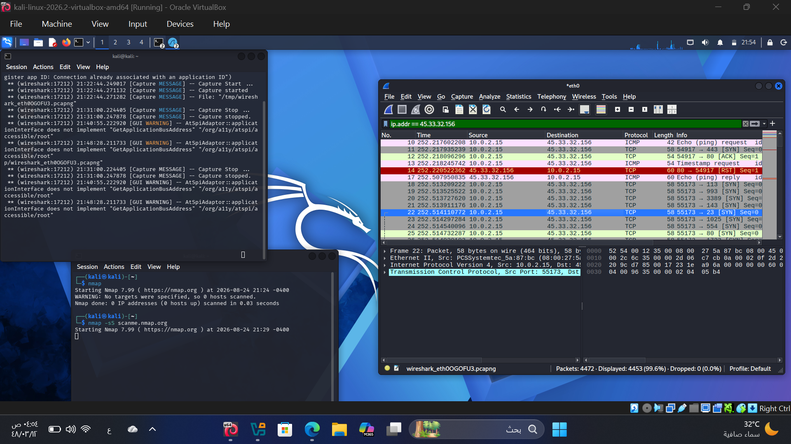
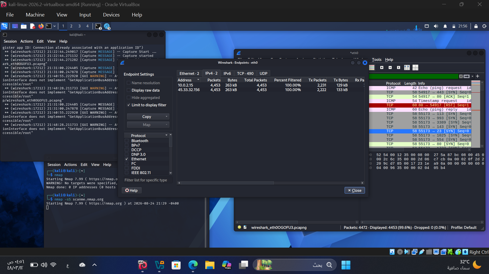

# 🛡️ Wireshark Network Traffic Analysis & Reconnaissance Detection

## 📌 Project Overview
This project demonstrates basic network analysis and traffic investigation using **Wireshark** on a **Kali Linux** virtual environment. The objective was to generate, capture, and analyze network traffic resulting from port scanning activities to understand threat detection methodologies applied in a Security Operations Center (SOC).

---

## 🛠️ Tools & Environment
* **OS:** Kali Linux (Oracle VirtualBox)
* **Traffic Analyzer:** Wireshark
* **Reconnaissance Tool:** Nmap

---

## 🔍 Investigation Steps & Analysis

### 1. Generating Traffic (Nmap SYN Scan)
Executed a stealth SYN scan (`-sS`) against `scanme.nmap.org` using Nmap:
```bash
nmap -sS scanme.nmap.org
```
### 2. Wireshark Capture & Display Filters

#### A. SYN Flag Filter (Reconnaissance Detection)
Applied the filter `tcp.flags.syn == 1` to isolate connection initiation requests.



#### B. IP Destination Traffic Filter
Applied the filter `ip.addr == 45.33.32.156` to inspect bidirectional traffic between the host machine and the target destination.



#### C. Network Endpoints Statistics
Analyzed host conversations and packet volumes via **Statistics -> Endpoints (IPv4)**.



---

## 💡 Key Takeaways & SOC Relevance
* **Half-Open Scanning:** Identified how SYN scans send single packets without completing the 3-way TCP handshake to evade deep logging.
* **Traffic Isolation:** Used Wireshark display filters to reduce noise during incident investigation.
* **Network Visibility:** Extracted IP endpoints to determine the origin and volume of network interactions.
